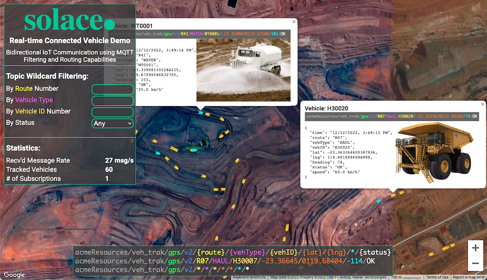

# Connected Vehicle Demo Web

## Introduction



This is basically a copy and refactoring of [Aaron](https://github.com/aaron-613)'s amazing [Real-time Connected Buses Demo](https://sg.solace.com/bus/). The main purpose of the refactoring is to make the application more configurable.

Together with the [data-generator](../connected-vehicle-data-generator/) project, you'd be able to customize the route's path, the speed of the vehicles, and the icon and picture of each vehicle type. It will you more easily to build a real-time connected **Things** demo on the google map for a particular situation, for example a connected Bike demo of the San Francisco city, or even a connected Boat demo of the Hong Kong city.

## Configuration Guide

You could setup icon and picture for each vehicle type in this project, please check the [data-generator](../connected-vehicle-data-generator/) project for customization of routes.

File [config.js](./config.js) is where we write the configuration:

```javascript
const config = {
  //"trace","debug","info","warn","error"
  logLevel: "debug",

  mapOptions: {
    center: { lat: -23.3644177610712, lng: 119.67464837435948 }, // Newman Mine Site
    zoom: 16,
    mapId: "DEMO_MAP_ID",
    mapTypeId: 'hybrid',
    fullscreenControl: false,
    streetViewControl: false,
    scaleControl: true,
    drawable: true,
  },

  solace: {...
    SessionProperties: {
      // check (https://docs.solace.com/API-Developer-Online-Ref-Documentation/js/solace.SessionProperties.html)
      // for details of all properties
      url: "ws://localhost:8008",
      vpnName: "default",
      userName: "default",
      password: "default",
    },
    // FATAL: 0, ERROR: 1, WARN: 2, INFO: 3, DEBUG: 4, TRACE: 5
    // NOTICE: works only with "solclientjs-debug.js"
    LogLevel: 1,
  },

  iconBase: "./icons/",
  vehicleTypes: {
    HAUL: { // type name
      reportInterval: 3, // seconds
      icon: "haul.svg",
      bodyLength: 15, // meters
      infoImage: "haul-truck-info.jpeg"
    },
    WATER: {
      reportInterval: 3, // seconds
      icon: "water.svg",
      bodyLength: 15, // meters
      infoImage: "water-truck-info.png"
    },
  }
}
```

You could config:

- The `center` of the `mapOptions` is the particular location you want to show
- Modify the `SessionProperties` to point to the same Solace broker with the [data-generator](../connected-vehicle-data-generator/) project
- Each key of the `vehicleTypes` object is a **vehicle type**, you could specify the icon and picture(used in the popup Info Window) here.
  - Make sure the key name is exactly same as the name of vehicle type in the [data-generator](../connected-vehicle-data-generator/) project
  - Make sure the icon is vertically upward, it will be rotated according to the real-time message.
  - The vehicle is supposed to report its status on every `reportInterval` seconds. The value is used to determine when to fade out inactive vehicles
  - The value of `bodyLength` is used to determine the size of the icon on the map

## How to run the demo

This web front is just a bunch of static files, you could put it under any web server and then open the URL with a modern web browser.

For example, you could run the command `python -m http.server 9010` under the root folder of the project, then access the demo by http://localhost:9010/.

## TODO

- [ ] Add support of GEO filtering
